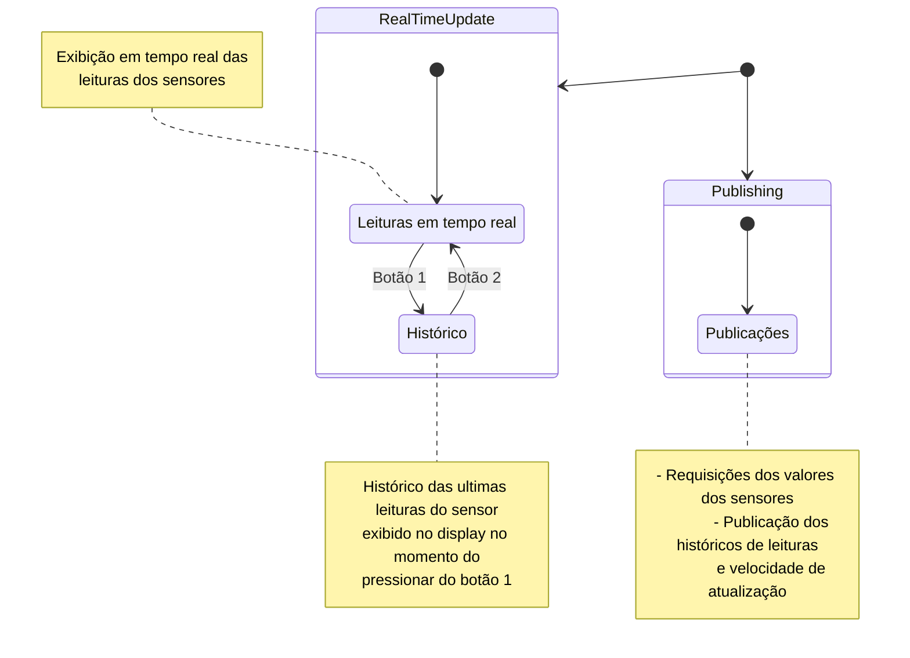

<!-- TABLE OF CONTENTS -->

## Tabela de Conteúdo

- [Tabela de Conteúdo](#tabela-de-conte%C3%BAdo)
- [Sobre o Projeto](#sobre-o-projeto)
   - [O problema](#)
   - [Requisitos](#)
   - [Arquitetura da soluçao](#arquitetura)
      - [Diagrama geral da solução](#)
      - [Diagrama da SBC](#diagrama-de-estados-da-sbc)
      - [Diagrama da NODE_MCU](#)
      - [Diagrama de sequencia](#)
      - [Formato das mensagens do historico](#interface-dos-dados-enviados-nos-topicos-de-historico)
- [Feito Com](#feito-com)
- [Começando](#come%C3%A7ando)
  - [Pré-requisitos](#pr%C3%A9-requisitos)
  - [Estrutura de Arquivos](#estrutura-de-arquivos)
  - [Instalação](#instala%C3%A7%C3%A3o)
  - [Edição](#edi%C3%A7%C3%A3o)
  - [Executar projeto](#executar-projeto)
- [Testes](#autores)
- [Possiveis melhorias](#autores)
- [Autores](#autores)
- [Materiais de referência](#materiais-de-referência)
- [Contribuição](#contribui%C3%A7%C3%A3o)

<!-- PROJECT LOGO -->
## Sobre o projeto
Projeto de sensor analógico/digital em microcontrolador utilizando comunicação serial.

Implementando de um protótipo de sistema de sensoriamento genérico de uma plataforma baseada na NodeMCU para confecção das unidades de sensoriamento modular comandado por um Single Board Computer (SBC), capaz de controlar o acionamento de um conjunto variável de sensores, assim como monitorar o seu funcionamento, de forma automatizada por meio de uma comunicação UART
<br />

### Arquitetura

### Diagrama de estados da SBC



<br>

<!-- ABOUT THE PROJECT -->

<br>

## Interface dos dados enviados nos topicos de historico

As mensagens enviadas pela SBC aos topicos de historico:
   - analogic/history
   - 5/history
   - 16/history

são formatadas como strings em formato [JSON((JavaScript Object Notation))](https://www.json.org/json-en.html). Como por exemplo:

```JSON
{"number_of_items": 10,"max_lenght": 10,"values": [ 0, 0, 0, 0, 0, 0, 0, 0, 0, 0 ]}
```
Segue, em typescript, a descrição de cada atributo da resposta

```typescript
/**
 * Interface (em typescript) dos dados enviados nos
 * topicos dos historicos de leituras dos sensores digitais
 * e analogico
 */
export interface history {
   /**
    * Quntidade de leituras atualmente no historico.
    */
  number_of_items: number
  /** 
   * Quantidade maxima de leituras no historico
   */
  max_lenght: number // 10 leituras atualmente
  /**
   * Lista dos ultimos valores lidos do sensor.
   * O primeiro valor da lista representa a leitura mais recente
   */
  values: number[]
}
```

Por padrão, number_of_items sempre tem no minimo tamanho 1, pois na SBC cada lista é inicializada com 1 leitura de valor zero. ou seja:

```typescript
values: number[] = [ 0 ];
```

## Feito Com

Abaixo segue o que foi utilizado na criação deste projeto:

- [GCC (GNU Compiler Collection)](https://gcc.gnu.org/) - O GNU Compiler Collection é um conjunto de compiladores de linguagens de programação produzido pelo projecto GNU.
- [ESP8266 SDK para Arduino](https://github.com/esp8266/Arduino) - Este projeto traz suporte ao chip ESP8266 para o ambiente Arduino.
- [Arduino IDE v1.8](https://www.arduino.cc/en/software) - O Arduino Software (IDE) de código aberto facilita a escrita de código e o upload para a placa. Este software pode ser usado com qualquer placa Arduino.

<br>

<!-- GETTING STARTED -->

## Começando

Para conseguir rodar o projeto, siga os passos abaixo.

### Pré-requisitos

Antes de seguirmos, é preciso que você tenha o ambiente configurado para criar e testar aplicações em C. 

No ambiente da SBC (considerando a Raspberry Pi rodando um sistema baseado no Debian) caso não tenha o tooling to GCC, execute:

```
$ sudo apt install build-essential
```
1. Instale a IDE do Arduino na versão 1.8 de acordo com a [documentação oficial](https://www.arduino.cc/en/software)
2. Abra as preferências da IDE e adicione o código abaixo, assim como na imagem e pressione o botão de OK

```
https://arduino.esp8266.com/stable/package_esp8266com_index.json
```

 

3. Em seguida, abra o gerenciador de placas da IDE e instale o Generic ESP8266 Module na versão 3.0.2, como na imagem:


4. Em seguida, abra o gerenciador de bibliotecas e instale a biblioteca PubSubClient by Nick O'Leary, como na imagem:


### Estrutura de Arquivos

A estrutura de arquivos está da seguinte maneira:

```bash
ESP8266_ES
├── NodeMCU/
│   ├── NodeMCU.cpp
├── Raspberry/
│   ├── display.h
│   ├── makefile
│   ├── display.o
│   └── main.c
├── .gitignore
└── README.md
```

Serão explicados os arquivos e diretórios na seção de [Edição](#edição).

### Instalação na NodeMCU

1. Abra a ide do Arduino
2. Abra o menu: Ferramentas > Placa e selecione a placa NodeMCU 1.0
3. Conecte a NodeMCU ao computador via usb
4. Copie o diretorio NodeMCU para dentro do diretorio de projetos do arduino, abra a IDE e abra o arquivo NodeMCU.ino. Copile e carrege o codigo na ESP8266
5. Selecione a porta no menu: Ferramentas > Porta
6. Carregue o codigo na placa (Ctrl + u)

### Instalação na SBC

1. Na SBC, faça clone do projeto utilizando o comando e navegue para o diretório raiz do projeto:

```sh
$ git clone https://github.com/DanielSRS/mcute
$ cd mcute
```

7. Navegue até o diretório que contém o código a ser executado na SBC e faça build:

```sh
cd IHM_Local
make mock
make all
```

8. Execute a aplicação

```sh
make run
```

### Edição

Nesta seção haverão instruções caso você queira editar o projeto, explicando para que os diretórios são utilizados e também os arquivos de configuração.

- **NodeMCU** - Após execução do projeto, o analizador léxico irá gerar arquivos de saída neste diretório contendo as informações processadas em cada arquivo de entrada.

  - **NodeMCU.cpp** - Codigo da aplicação executada na NodeMCU responsável por interpretar os comandos enviados pela SBC, realizar a leitura dos sensores e enviar atraves da UART as informações solicitadas

- **IHM_Local** - Diretório contendo todos os arquivos da aplicação executada na SBC (Raspberry Pi),

  - **main.c** - Codigo da aplicação executada na SBC e responsável pelo controle da NodeMCU enviando comandos, lendo e exibindo as informações coletadas.

  - **makefile** - Arquivo de configuração makefile com as instruções de build do projeto.

  - **display.h** - Arquivo de cabeçalho da biblioteca de comunicação com o display 16x2.

  - **display.o** - Biblioteca para comunicação com o display 16x2.

- **.gitignore** - Arquivo de configurção do git contendo informções de arquivos que não devem ser versionados junto com o codigo fonte;

- **README.md** -  Este arquivo. Aqui é feito a documentação basica do projeto com instruções de instalação, configuração e execução.

## Executar projeto (na SBC)

- Ainda no diretório raiz, navegue para o diretorio Raspberry:

  ```sh
  cd IHM_Local
  ```
- Faça o build da aplicação

  ```sh
  make mock
  make all
  ```

- Faça o build e rode a aplicação

  ```sh
  make run
  ```

- Execute manualmente a aplicação informando o sensor analógico e dois digitais conectados

  ```sh
  $ sudo ./Rasp -analogic -d."D0".16 -d."D1".5
  ```

<br>

## Materiais de referência
[Raspberry Pi Documentation](https://www.raspberrypi.com/documentation/computers/raspberry-pi.html#raspberry-pi-zero-w)

[Display LCD HD44780U](https://www.google.com/url?sa=t&source=web&rct=j&url=https://www.sparkfun.com/datasheets/LCD/HD44780.pdf&ved=2ahUKEwjso46tlqn6AhVGL7kGHSe6BMEQFnoECGIQAQ&usg=AOvVaw076YT-P88DM3oFFvTDUv43)

[BCM2835 ARM Peripherals](https://www.raspberrypi.org/app/uploads/2012/02/BCM2835-ARM-Peripherals.pdf)

[ESP8266 Arduino Core Documentation](https://readthedocs.org/projects/arduino-esp8266/downloads/pdf/latest/)

[Documentação de Referência da Linguagem Arduino](https://www.arduino.cc/reference/pt/)

[ESP8266WiFi library](https://arduino-esp8266.readthedocs.io/en/latest/esp8266wifi/readme.html)

[ESP8266mDNS library](https://www.arduino.cc/reference/en/libraries/esp8266_mdns/)

[WifiUdp library](https://www.arduino.cc/reference/en/libraries/wifi/wifiudp/)

[ArduinoOTA](https://www.arduino.cc/reference/en/libraries/arduinoota/)

[SoftwareSerial Library](https://www.google.com/url?sa=t&rct=j&q=&esrc=s&source=web&cd=&cad=rja&uact=8&ved=2ahUKEwjSluW4ypz7AhU_kZUCHbP9C5kQFnoECAoQAQ&url=https%3A%2F%2Fwww.arduino.cc%2Fen%2FReference%2FsoftwareSerial&usg=AOvVaw2kUbQNvvMDReS_1LIPB82g)

[HardwareSerial Library](https://github.com/espressif/arduino-esp32/blob/master/cores/esp32/HardwareSerial.h)

[Termios Library](https://pubs.opengroup.org/onlinepubs/7908799/xsh/termios.h.html)

Autores
=======
| [<br><sub>Alexandre Silva Caribé</sub>](https://github.com/AlexandreCaribe) | [<br><sub>Alisson Bonfim Silva</sub>](https://github.com/absilva21) | [<br><sub>Daniel Santa Rosa Santos</sub>](https://github.com/DanielSRS) |  [<br><sub>Joanderson Santos</sub>](https://github.com/Joanderson90) |
| :---: | :---: | :---: | :---: |

## Contribuição

- Quaisquer dúvidas, sugestões ou problemas que encontrar, fique livre para abrir uma issue.
- Se quiser contribuir ajustando o codigo, implementando novas funcionalidas ou corrigindo bugs, faça um fork do projeto, faça as alterações nescessárias como descrito na seção de [Edição](#edição) e abra um pull request
